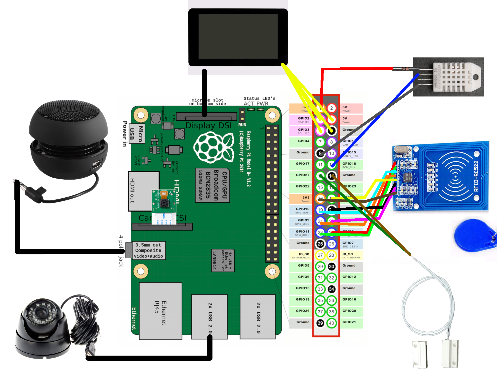

# securiphant

|master|develop|
|:----:|:-----:|
|[](https://gitlab.namibsun.net/namibsun/python/securiphant/commits/master)|[](https://gitlab.namibsun.net/namibsun/python/securiphant/commits/develop)|


securiphant is a surveillance, security and home automation solution
meant to be used on a raspberry pi. It currently offers the following
functionality:

* Remote Access to video footage of cameras connected to the raspberry pi
* A display displaying the state of the system and environmental data
* An automated break-in detector with alerts sent via telegram

# What does it do

## Break-In detection

Securiphant makes use of a door sensor and an RFID reader to check
for break-ins. Once the door has been opened, the system will
offer a 15 seconds long period in which the person entering may
authenticate using an RFID tag. During that time, a video
recording of the door area is created using either a
raspberry pi camera and/or a USB Camera. If the user does not
authenticate during the 15 seconds, this video recording
is sent to the owner of the securiphant system using telegram.

## Environmental data

Securiphant keeps track of temperature and humidity data and can
display those on a screen or send them using telegram.

# Status display

Securiphant comes with a GUI application that shows the current state
of the system.

# Setup

The setup requires the following parts:

* Raspberry Pi 3 Model B
* MicroSD card
* Raspberry Pi 7 inch display + case
* Raspberry Pi Camera
* Magnetic Contact Switch (Door Sensor)
* RC522 RFID reader + tag
* USB Camera
* Speakers
* DHT22 Temperature and Humidity Sensor
* Jumper Cables etc.

The connection layout looks like this:



# Installation

The installation assumes an up-to-date installation of Raspbian.
The project was developed using python 3, it most likely won't
work using python 2, so make sure to always use ```python3```
and ```pip3```.

Securiphant makes use of ```PyQT5``` and ```python-opencv```, both
of which can not be installed using ```pip3```.

Installing PyQT5 is as easy as running
```sudo apt install qt5-default pyqt5-dev pyqt5-dev-tools```

OpenCV is a bit trickier and must be built from source.
A guide for doing so that I have confirmed to work is available
[here](https://www.pyimagesearch.com/2018/09/26/install-opencv-4-on-your-raspberry-pi/),
although [this guide](https://www.learnopencv.com/install-opencv-4-on-raspberry-pi/) might
be better due to including a lot more codecs during the preparatory phase.

After both of those have been installed, you can simply run
```python3 setup.py install``` to install securiphant.

To correctly function, securiphant also requires the following to be installed:

* systemd
* opencv 4.0
* flite
* python3-mysqldb

## Post-Installation Configuration

After the installation, you'll have to take care of some configuration:

To initialize the RFID tag, run ```securiphant-nfc-initialize```
after installation, then hold the RFID tag to use to the RFID reader.

To initialize the weather configuration, run
```securiphant-weather-initialize <APIKEY> <LOCATION>```.

To initialize the telegram sending functionality,
first run ```securiphant-alert-bot --initialize``` and enter your API
key. At the end, a key wil be output onto the command line. Take note of this
key, as you'll have to use it to register your telegram address with the
bot.
Afterwards, start the bot using ```securiphant-alert-bot``` and send it
the message ```/start```. Then send it the key you received in the previous
step using ```/init <KEY>```. Once initialized, the bot won't react to any
other telegram users but this one. To reset this key, run
```securiphant-alert-bot --initialize``` once more.

# Running the application

You can start each individual securiphant module either by running
the script itself or start the systemd user unit.

Running the script directly would look like this:

```securiphant-display```

Using the systemd user unit would look like this:

```systemctl --user start securiphant-display.service```

To run securiphant in its entirety, you can use the ```securiphant start```
command. This starts all securiphant systemd user units.
To stop these services, run ```securiphant stop```.

## Further Information

* [Changelog](CHANGELOG)
* [License (GPLv3)](LICENSE)
* [Gitlab](https://gitlab.namibsun.net/namibsun/python/securiphant)
* [Github](https://github.com/namboy94/securiphant)
* [Progstats](https://progstats.namibsun.net/projects/securiphant)
* [PyPi](https://pypi.org/project/securiphant)
